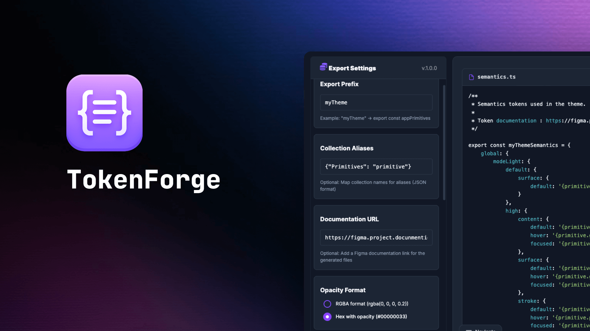

# 🧩 TokenForge

> Exportez vos variables Figma en **tokens intelligents** prêts à l’emploi pour vos projets front-end.  
> Créez un pont fluide entre **designers** et **développeurs**, sans dépendre d’outils complexes.

---

## 🚀 Fonctionnalités clés

-  **Export rapide** des variables Figma : couleurs, typographies, espacements…
- **Préservation des alias et références** entre variables.
- **Organisation claire par collections** avec hiérarchie complète.
- **Export multi-format** : Javascript - TypeScript (`.ts`)  / CSS (`.css`) - SCSS (`.scss`) / JSON.

---

## ⚙️ Options avancées

- **Préfixe personnalisé** pour vos exports.
- **Gestion des modes** : clair, sombre ou tous.
- **Choix du format de couleur** : `RGBA` ou `HEX`.
- **Hiérarchie intelligente** et export proprement structuré.

---

## 🖥️ Interface intuitive

- **Prévisualisation en temps réel** des tokens générés.
- **Thème clair / sombre** adaptable à votre système.
- **Navigation fluide** entre fichiers et catégories.

---

## ✨ Fonctions pratiques

- **Copie rapide** du code généré.
- **Téléchargement individuel ou groupé** des exports.
- **Support des commentaires de documentation** (description Figma incluse).

---

## 🎯 Pour qui ?

**TokenForge** s’adresse aux :

-  **Développeurs** souhaitant intégrer rapidement les variables du design system.
- **Designers** voulant conserver la cohérence entre Figma et le code.
-  Équipes cherchant à éviter la complexité des outils de synchronisation.

> Exportez. Intégrez. Automatisez.  
> **TokenForge** forge vos design tokens, sans friction.

---

## 🪄 Forgé par

**Robin Lopez**  
🔗 [bento.me/robinlopez](https://bento.me/robinlopez)
